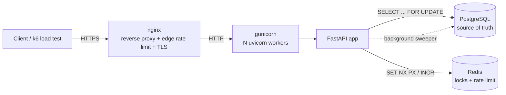
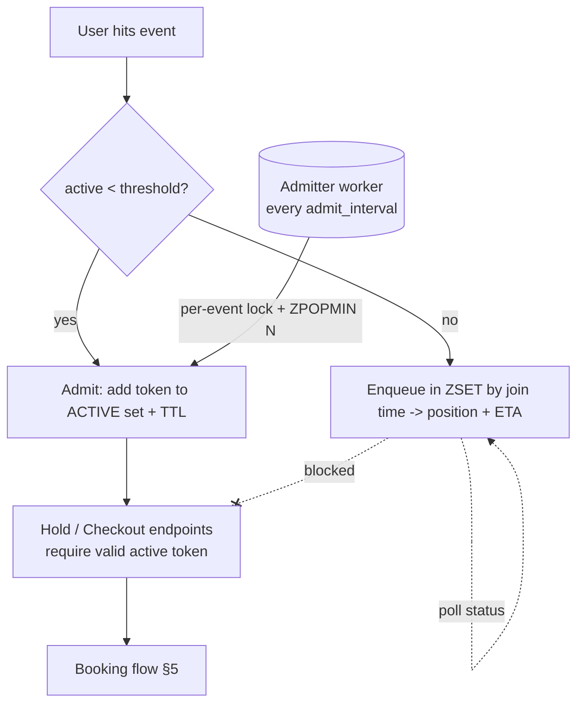
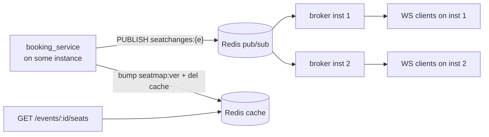

# TicketFlow — High-Level Design (HLD)

## 1. Problem statement
Build a ticket-booking backend where many users compete for the **same limited
seats** at the same instant (think a concert on-sale). The system must guarantee
that **a seat is sold at most once**, stay responsive under bursts, and be
operable on a single cloud VM while having a clear path to horizontal scale.

## 2. Functional requirements
- Users register / log in (JWT auth).
- Browse events and their live seat map.
- Temporarily **hold** seats (cart), with automatic expiry.
- **Confirm** a booking for held/available seats.
- View and cancel one's bookings.

## 3. Non-functional requirements
| Concern | Target |
|---|---|
| Correctness | Zero double-bookings under any concurrency |
| Availability | Single-VM now; stateless API ready to scale horizontally |
| Latency | Booking write path p95 < ~150 ms under normal load |
| Abuse resistance | Per-IP rate limiting at edge (nginx) and app (Redis) |
| Observability | Health/readiness probes, structured request logs |

## 4. Architecture



**Request path:** `Client → nginx → gunicorn (uvicorn workers) → FastAPI → {Postgres, Redis}`

### Component responsibilities
- **nginx** — TLS termination, edge rate limiting (`limit_req`), real-client-IP
  forwarding, buffering, single public entrypoint.
- **gunicorn + uvicorn workers** — process manager running multiple worker
  processes; this is how a single VM uses all CPU cores.
- **FastAPI app** — stateless business logic; can be replicated freely because no
  state lives in process memory (state is in Postgres/Redis).
- **PostgreSQL** — authoritative store; row-level locks (`FOR UPDATE`) provide the
  hard correctness guarantee.
- **Redis** — distributed locks (cheap pre-DB contention control across all
  workers/instances) and rate-limit counters.

## 5. The lifecycle: select → hold → pay → confirm
A booking is no longer created on click. The flow is:

1. **HOLD** (`POST /holds`) — reserve seats `AVAILABLE → HELD` all-or-nothing,
   creating a `Hold` (ACTIVE, 10-min TTL). This is the **concurrency-critical**
   step and where the two-layer lock guarantees no two users reserve the same seat.
2. **PAY** (`POST /holds/{id}/checkout`) — create a Stripe Checkout Session for
   the hold. The hold must still be valid; if the TTL lapsed, return `410` and
   release the seats — **no session is created, nothing is charged**.
3. **CONFIRM** (`POST /webhooks/stripe`) — on `checkout.session.completed`,
   convert the still-valid hold `HELD → SOLD` and write the `Booking` in one
   transaction. **Idempotent** (see §8). If the hold lapsed before payment
   settled, **refund** and do not grant seats.

### The two-layer lock (unchanged, now applied at HOLD + CONFIRM)
1. **Redis distributed lock (fast, cross-process)** — `SET key token NX PX ttl`
   before touching the DB; token-checked Lua release (no lock-stealing); TTL
   prevents permanent deadlock on crash.
2. **PostgreSQL row lock (authoritative)** — `SELECT ... FOR UPDATE` on the seat
   rows; availability re-validated *inside* the lock. Even if Redis is wiped,
   correctness holds.

```mermaid
sequenceDiagram
    participant U as User
    participant A as FastAPI
    participant R as Redis
    participant D as Postgres
    participant S as Stripe
    U->>A: POST /holds {seats}
    A->>R: lock seats (NX PX)
    A->>D: SELECT FOR UPDATE; reclaim expired; if available -> HELD + Hold(ACTIVE,TTL); COMMIT
    A-->>U: 201 hold {id, expires_at} (or 409 seats_taken)
    U->>A: POST /holds/{id}/checkout
    alt hold still valid
        A->>S: create Checkout Session (Idempotency-Key=checkout-{id})
        A-->>U: checkout_url
        U->>S: pay (hosted page)
        S->>A: webhook checkout.session.completed (evt id)
        A->>D: lock seats + hold FOR UPDATE
        alt hold ACTIVE & not expired & seats still HELD
            A->>D: seats -> SOLD; INSERT Booking(hold_id unique); hold -> CONVERTED; record evt; COMMIT
            A-->>S: 200 confirmed
        else hold lapsed before payment settled
            A->>D: release seats; hold -> EXPIRED; record evt; COMMIT
            A->>S: refund(payment_intent)
            A-->>S: 200 refunded
        end
    else TTL already expired
        A->>D: release seats; hold -> EXPIRED
        A-->>U: 410 Gone (nothing charged)
    end
```

## 6. Deadlock avoidance
Every path acquires Redis seat locks in **sorted seat-id order**, then takes
Postgres row locks in a **fixed order: seats first, then holds**. No two paths
can form a circular wait.

## 7. Hold expiry reconciliation
The Redis lock TTL only protects the critical section — the **DB** must reconcile
expired holds. Handled two ways: **lazily** (`create_hold` reclaims a seat whose
hold has expired the moment someone re-selects it) and **proactively** (a
background sweeper every 15 s flips `ACTIVE` holds past their TTL to `EXPIRED`
and their seats back to `AVAILABLE`).

## 8. Idempotency (no double-booking, no double-charge)
- **`bookings.hold_id` is UNIQUE** — a hold converts to at most one booking, so a
  duplicate webhook or double-submit can never create two bookings.
- **`processed_webhook_events.stripe_event_id` is UNIQUE** — a Stripe event is
  applied at most once; redelivery is a no-op.
- **Stripe `Idempotency-Key`** on checkout-session creation and refunds — a
  retried "pay" never opens two sessions or double-charges/refunds.
- **Partial unique index** `booking_items(seat_id) WHERE active` — the DB-level
  *final guard* that a seat is sold to at most one active booking, even if app
  logic ever slipped. Cancel/refund flips `active=False`, freeing the seat.

## 9. Virtual waiting room (on-sale spike protection)
At on-sale, demand can be 100× capacity. The waiting room is an admission gate in
front of the booking path so the seat-map / hold / checkout endpoints only ever
see a bounded number of users.

**Data structures (per event, in Redis):**
- `waitroom:q:{event}` — **sorted set**, member = session token, score = join time
  (ms). `ZRANK` gives position; FIFO order gives **fairness**.
- `waitroom:active:{event}` — **sorted set**, member = token, score = expiry (ms).
  Active count = `ZCARD` after pruning expired (`ZREMRANGEBYSCORE -inf now`).

**Flow:** `join` admits immediately while `active < threshold`, else enqueues and
returns a position + ETA. A background **admitter** promotes the front of the
queue (`ZPOPMIN`) into `active` every `admit_interval`, up to `admit_batch`. The
hold/checkout endpoints **require a valid admission token** (heartbeat-refreshed),
so queued users physically cannot book. Everything is **config-driven**
(`WAITROOM_ENABLED`, `WAITROOM_ACTIVE_THRESHOLD`, …) — set a low threshold to demo.



- **Load shedding:** over-threshold traffic sits in a cheap Redis ZSET; it never
  reaches Postgres or the locking path, protecting the DB connection pool.
- **Fairness:** strict FIFO by join timestamp (`ZRANK` / `ZPOPMIN`).
- **Scaling the admitter horizontally:** admission is guarded by a per-event Redis
  lock plus **atomic `ZPOPMIN`**, so N admitter instances can run without ever
  exceeding the threshold (no user admitted twice). For very high event counts,
  shard events across admitters (consistent hashing) or elect one admitter per
  event via a Redis lease. Active-session expiry is self-healing via TTL +
  heartbeat (no admitted user is stuck if a client disconnects).

## 9b. Real-time seat updates + seat-map cache
The seat map is the hottest read and must feel live. Two pieces:

**Seat-map cache (version-invalidated).** The map (layout + availability) is served
from Redis: `seatmap:{event}` holds `{v, seats[]}` and `seatmap:ver:{event}` is an
integer bumped on *any* seat change. A read returns the cached blob when its `v`
matches the current version key; otherwise it rebuilds from Postgres and re-caches.
So the hot path is two Redis GETs and Postgres is touched only on a miss or right
after a change — there's no per-change cache surgery, the version bump alone
invalidates. (Invalidation lives in `seatcache.invalidate`, called on every
mutation; TTL is a backstop.)

**Live deltas over WebSocket + Redis pub/sub.** Every seat state change publishes a
delta to `seatchanges:{event}`. Each app instance runs a broker that subscribes
and fans the delta out to the WebSocket clients connected to *that* instance. The
frontend opens one WS per event, applies a snapshot on connect, then patches seats
from deltas — **no polling**. Change events are surfaced to the UI as an animatable
"taken by someone else" signal.



A change on **any** instance reaches clients on **every** instance, because the
transport is Redis pub/sub — not in-process memory.

### Scaling story: sticky sessions vs Redis fan-out
- **Naive in-memory broadcast** (no Redis) would require **sticky sessions** — a
  user's WS and the worker that mutates their seat must be the same process, which
  breaks the moment you run >1 worker or >1 box.
- **Redis pub/sub fan-out** (what we do) removes that constraint: WS connections can
  land on any instance via a normal load balancer; the publish reaches all brokers.
  You still want **connection-aware LB** (or sticky at the LB only for connection
  affinity, not correctness) so a client stays on one socket, but **correctness no
  longer depends on stickiness**.
- Next step at very large scale: replace Redis pub/sub with a dedicated fan-out tier
  (Redis Streams with consumer groups, or NATS/Kafka) and a pool of stateless WS
  gateways; shard channels by event. The app code already treats the broker as a
  pluggable transport.

**Implementation note:** the broker runs on a dedicated thread using the *sync*
Redis client polled via `get_message(timeout=…)` (not async `listen()`), bridging
to the event loop with `run_coroutine_threadsafe`. This is deliberate — the async
pub/sub reader was unreliable under uvicorn's Windows ProactorEventLoop, and a
blocking `listen()` dies on the connection's idle read-timeout.

## 10. Scaling plan (how I'd take this to 100k concurrent users)
| Bottleneck | Mitigation |
|---|---|
| Single API process | Already stateless → run many gunicorn workers, then many API instances behind a load balancer (ALB). |
| Postgres write contention on hot events | Partition seats; shard by event; use connection pooler (PgBouncer); read replicas for the seat-map reads. |
| Thundering herd at on-sale | **Virtual waiting room (§9) — implemented**: bounded admission keeps the booking path under capacity. |
| Read load (seat maps) | Cache seat map in Redis with short TTL + invalidate on write (`version` column detects staleness). |
| Payment latency | Move confirmation to an async flow: hold → enqueue payment (queue/worker) → confirm, with idempotency keys. |
| Single point of failure | Managed Postgres (RDS) with Multi-AZ failover; Redis with replication/Sentinel. |

## 11. Trade-offs chosen
- **Pessimistic locking** over optimistic for the write path: contention on a hot
  seat is *expected*, so locking avoids a retry storm. Optimistic (version
  column) is documented in the LLD as the alternative and is retained for reads.
- **Synchronous SQLAlchemy** in threadpool-executed endpoints: makes the
  transactional `FOR UPDATE` logic simple and explicit; uvicorn workers still
  give real concurrency.
- **Fixed-window rate limit**: simplest correct-enough algorithm; sliding window
  is the noted upgrade.
