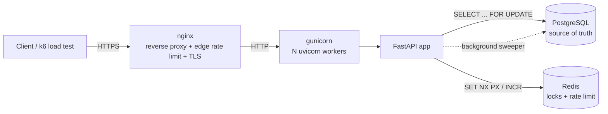

# TicketFlow — High-Level Design (HLD)

## 1. Problem statement
Build a ticket-booking backend where many users compete for the **same limited
seats** at the same instant (think a concert on-sale). The system must guarantee
that **a seat is sold at most once**, stay responsive under bursts, and be
operable on a single cloud VM while having a clear path to horizontal scale.

## 2. Functional requirements
- Users register / log in (JWT auth).
- Browse events and their live seat map.
- Temporarily **hold** seats (cart), with automatic expiry.
- **Confirm** a booking for held/available seats.
- View and cancel one's bookings.

## 3. Non-functional requirements
| Concern | Target |
|---|---|
| Correctness | Zero double-bookings under any concurrency |
| Availability | Single-VM now; stateless API ready to scale horizontally |
| Latency | Booking write path p95 < ~150 ms under normal load |
| Abuse resistance | Per-IP rate limiting at edge (nginx) and app (Redis) |
| Observability | Health/readiness probes, structured request logs |

## 4. Architecture



**Request path:** `Client → nginx → gunicorn (uvicorn workers) → FastAPI → {Postgres, Redis}`

### Component responsibilities
- **nginx** — TLS termination, edge rate limiting (`limit_req`), real-client-IP
  forwarding, buffering, single public entrypoint.
- **gunicorn + uvicorn workers** — process manager running multiple worker
  processes; this is how a single VM uses all CPU cores.
- **FastAPI app** — stateless business logic; can be replicated freely because no
  state lives in process memory (state is in Postgres/Redis).
- **PostgreSQL** — authoritative store; row-level locks (`FOR UPDATE`) provide the
  hard correctness guarantee.
- **Redis** — distributed locks (cheap pre-DB contention control across all
  workers/instances) and rate-limit counters.

## 5. The core problem: preventing double-booking
Two layers, defence in depth:

1. **Redis distributed lock (fast, cross-process).** Before touching the DB, a
   request acquires a per-seat lock (`SET key token NX PX ttl`). This serialises
   contenders cheaply and protects the DB connection pool from a thundering herd.
   Lock release is token-checked via a Lua script (no lock stealing); a TTL
   prevents permanent deadlock if a worker crashes.
2. **PostgreSQL row lock (authoritative).** Inside a transaction,
   `SELECT ... FOR UPDATE` locks the seat rows. Availability is re-validated
   *inside* the lock — never trust a pre-check — then seats flip to `BOOKED` and
   the booking is written atomically. The DB lock is the real guarantee; even if
   Redis is wiped, correctness holds.

```mermaid
sequenceDiagram
    participant U as User
    participant A as FastAPI
    participant R as Redis
    participant D as Postgres
    U->>A: POST /bookings {seat 42}
    A->>R: SET lock:seat:42 NX PX 5000
    alt lock acquired
        A->>D: BEGIN; SELECT seat 42 FOR UPDATE
        A->>A: re-check availability inside lock
        alt available
            A->>D: UPDATE seat 42 -> BOOKED; INSERT booking; COMMIT
            A->>R: release lock (token-checked)
            A-->>U: 201 Created
        else taken
            A->>D: ROLLBACK
            A-->>U: 409 Conflict
        end
    else lock busy
        A-->>U: 503 retry (high demand)
    end
```

## 6. Deadlock avoidance
Multi-seat bookings acquire locks (Redis **and** DB) in a globally consistent
order — seat ids sorted ascending. Two overlapping bookings therefore request
shared resources in the same order, so a circular wait is impossible.

## 7. Hold lifecycle
A hold sets `status=HELD`, `held_by`, `hold_expires_at`. Expiry is handled two
ways: **lazily** (an expired hold is treated as available the moment anyone tries
to book it) and **proactively** (a background sweeper every 15 s flips stale
holds back to `AVAILABLE` to keep the seat map clean for reads).

## 8. Scaling plan (how I'd take this to 100k concurrent users)
| Bottleneck | Mitigation |
|---|---|
| Single API process | Already stateless → run many gunicorn workers, then many API instances behind a load balancer (ALB). |
| Postgres write contention on hot events | Partition seats; shard by event; use connection pooler (PgBouncer); read replicas for the seat-map reads. |
| Thundering herd at on-sale | Virtual **waiting room / queue** (token-bucket admission) in front of the booking endpoint; Redis already gates contention. |
| Read load (seat maps) | Cache seat map in Redis with short TTL + invalidate on write (`version` column detects staleness). |
| Payment latency | Move confirmation to an async flow: hold → enqueue payment (queue/worker) → confirm, with idempotency keys. |
| Single point of failure | Managed Postgres (RDS) with Multi-AZ failover; Redis with replication/Sentinel. |

## 9. Trade-offs chosen
- **Pessimistic locking** over optimistic for the write path: contention on a hot
  seat is *expected*, so locking avoids a retry storm. Optimistic (version
  column) is documented in the LLD as the alternative and is retained for reads.
- **Synchronous SQLAlchemy** in threadpool-executed endpoints: makes the
  transactional `FOR UPDATE` logic simple and explicit; uvicorn workers still
  give real concurrency.
- **Fixed-window rate limit**: simplest correct-enough algorithm; sliding window
  is the noted upgrade.
