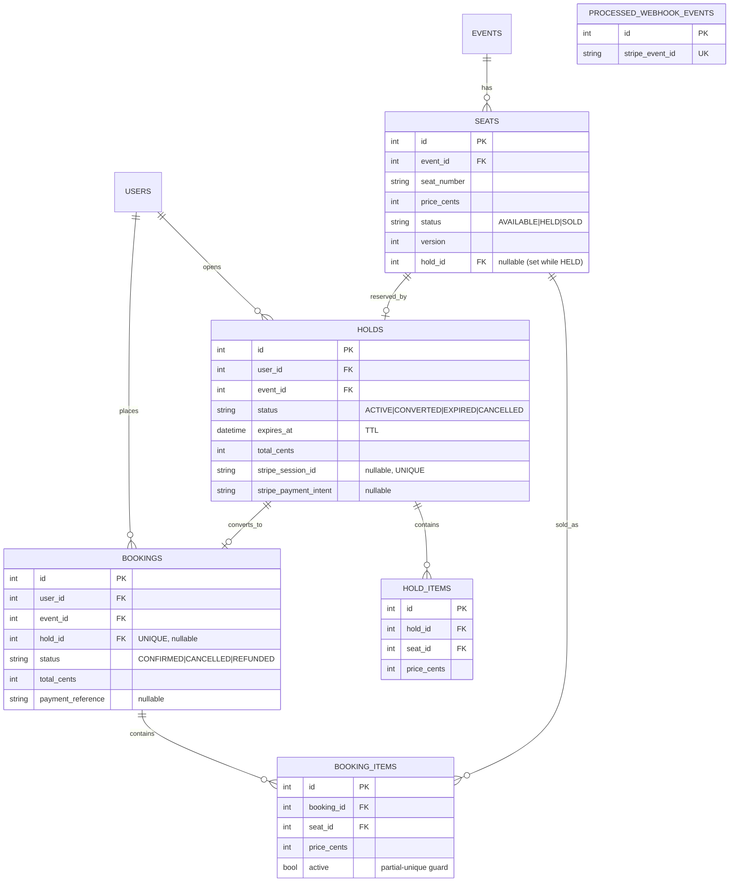
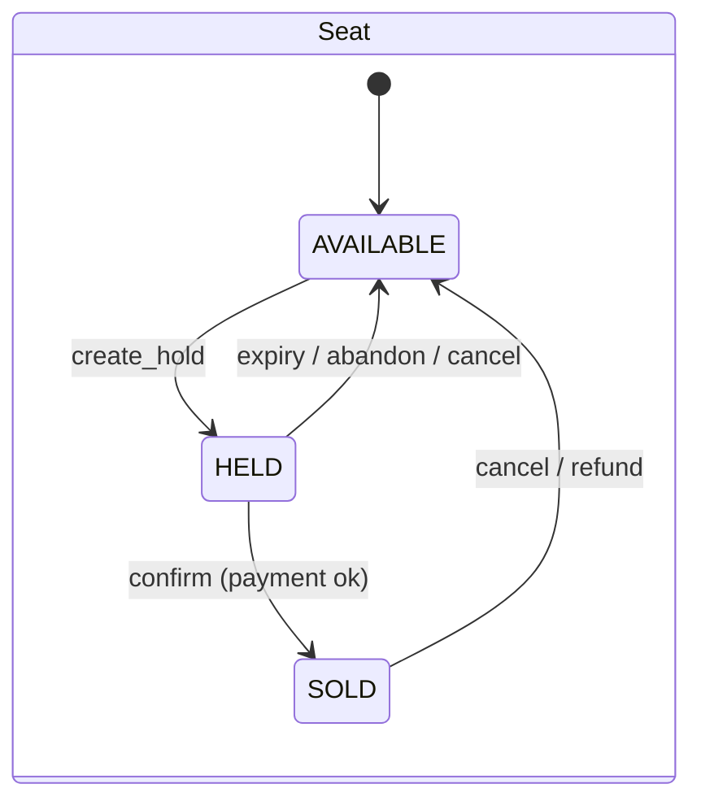
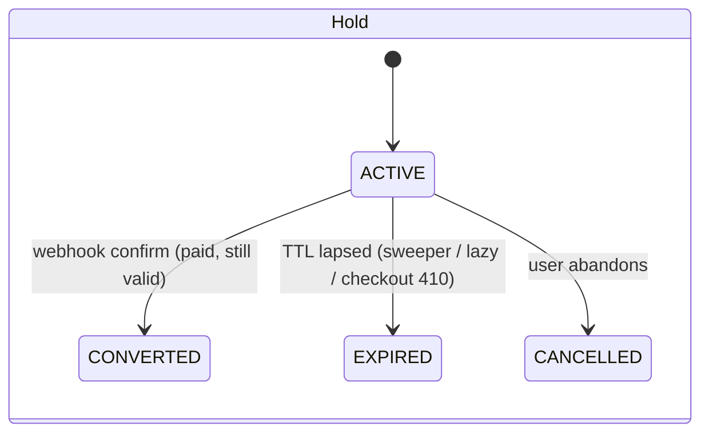

# TicketFlow — Low-Level Design (LLD)

## 1. Data model (ER diagram)



### Key constraints & indexes
- `UNIQUE(event_id, seat_number)` on seats — no duplicate seats per event.
- `UNIQUE(bookings.hold_id)` — a hold converts to at most one booking (idempotency).
- `UNIQUE(processed_webhook_events.stripe_event_id)` — each Stripe event applied once.
- **Partial unique** `booking_items(seat_id) WHERE active` — final anti-double-sell guard.
- `UNIQUE(holds.stripe_session_id)`; indexes on `holds.status`, `holds.expires_at`
  (sweeper), `seats.status`, `seats.hold_id`, `bookings.user_id`.

### Product entities (layered on top, concurrency core unchanged)
- `users.role` — USER \| ORGANIZER \| ADMIN (RBAC).
- `venues` — name/address/city; `events.venue_id` FK; `events.organizer_id` (ownership),
  `events.status` (DRAFT\|PUBLISHED), `events.description`.
- `price_tiers` (per event) + `seats.tier_id` + `seats.section` — multi-tier, sectioned maps.
- `tickets` — one per sold seat: `code` (UNIQUE), `status` (VALID\|USED\|CANCELLED),
  `used_at`, `checked_in_by`. Issued on confirm, voided on cancel, single-use on check-in.

## 2. State machines





Booking: `CONFIRMED → CANCELLED` (unpaid) or `CONFIRMED → REFUNDED` (paid, refunded).

## 3. Concurrency control — the critical sections

**create_hold** (reservation — where the race is resolved):
```python
with multi_lock(sorted_seat_keys):          # Layer 1: Redis distributed lock
    seats = SELECT ... FOR UPDATE            # Layer 2: DB row lock (seats first)
    reclaim seats whose hold has expired     # lazy expiry
    if any seat actively HELD/SOLD: rollback -> 409 {seats_taken}
    INSERT Hold(ACTIVE, TTL); seats -> HELD (hold_id set); COMMIT
```

**confirm_hold** (idempotent; lock order = seats, then hold):
```python
with multi_lock(sorted_seat_keys):
    if stripe_event_id already processed: return ALREADY_DONE   # gate 1
    seats = SELECT ... FOR UPDATE (populate_existing)
    hold  = SELECT hold FOR UPDATE (populate_existing)
    if hold.CONVERTED: return ALREADY_DONE                      # gate 2
    if hold not ACTIVE / expired / seats not still ours:
        release seats; hold -> EXPIRED; return REFUND_REQUIRED  # don't grant
    seats -> SOLD; INSERT Booking(hold_id UNIQUE) + items(active);
    hold -> CONVERTED; record processed event; COMMIT
# on IntegrityError (raced unique) -> rollback, return ALREADY_DONE
```

`populate_existing=True` on the locking selects forces a refresh from the locked
row, so a confirmer can never act on a stale identity-map copy of the hold/seat.

### Seat eligibility for a NEW hold (inside the lock)
| seat status | hold valid? | result |
|---|---|---|
| AVAILABLE | – | ✅ hold it |
| HELD | hold expired/dead | ✅ reclaim → hold it |
| HELD | hold ACTIVE & unexpired | ❌ 409 seats_taken |
| SOLD | – | ❌ 409 seats_taken |

### Redis lock invariants
- Acquire: `SET key <random-token> NX PX <ttl>`.
- Release: Lua `if GET key == token then DEL key` — prevents deleting a lock that
  a *later* owner acquired after our TTL lapsed.
- TTL (`lock_ttl_ms`) guarantees no permanent deadlock on worker crash.
- Multi-key acquisition is ordered (sorted seat ids) → no circular wait.

## 4. Pessimistic vs optimistic — why pessimistic here
- **Pessimistic (`FOR UPDATE`)** chosen for the booking write path. On a hot seat,
  contention is the norm; locking makes losers block briefly then fail fast with
  409, instead of all retrying (optimistic would cause a retry storm).
- **Optimistic (`version`)** retained for reads and as the documented alternative:
  `UPDATE seats SET status=..., version=version+1 WHERE id=? AND version=?` and
  check affected-row count. Better when contention is rare.

## 5. API surface
Roles: `USER` (attendee), `ORGANIZER`, `ADMIN` (granted, bypasses ownership). Set
at signup (`role`); admin is not self-selectable. Full interactive docs at `/docs`.

| Method | Path | Auth | Notes |
|---|---|---|---|
| POST | `/auth/register` | – | `role`: USER\|ORGANIZER; 409 on duplicate |
| POST | `/auth/login` | – | OAuth2 password form → JWT |
| GET | `/auth/me` | ✅ | current user (+ role) |
| **Events** | | | |
| GET | `/events` | – | browse; filters: `q`, `city`, `date_from`, `date_to` |
| GET | `/events/{id}` | – | detail: venue, tiers, capacity, available |
| POST | `/events` | 🛡️ organizer | create venue + tiers + sectioned seat map |
| GET | `/events/{id}/seats` | – | live seat map (Redis-cached) |
| **Waiting room** | | | |
| POST | `/waitroom/{event}/join` · GET `/status` | – | position / admission token |
| **Holds → pay → confirm** | | | |
| POST | `/holds` | ✅ + rate-limited (+ waitroom token when enabled) | reserve (HELD, TTL); 409 `{seats_taken}` |
| GET | `/holds/{id}` | ✅ | hold status + countdown |
| POST | `/holds/{id}/checkout` | ✅ + rate-limited | Stripe session; **410** if TTL lapsed |
| POST | `/webhooks/stripe` | – (sig-verified) | CONFIRM: hold→booking + issue tickets + email (idempotent) |
| **Bookings + tickets** | | | |
| GET | `/bookings` | ✅ | my bookings (+ tickets) |
| POST | `/bookings/{id}/cancel` | ✅ | cancel + Stripe refund + release seats + void tickets (atomic) |
| GET | `/tickets/{code}` · `/tickets/{code}/qr.svg` | ✅ owner | e-ticket + QR image |
| POST | `/tickets/{code}/checkin` | 🛡️ organizer (owns event) | single-use; 200 used · **409** already-used · 404 invalid |
| **Organizer dashboard** | | | |
| GET | `/organizer/events` | 🛡️ organizer | events I own |
| GET | `/organizer/events/{id}/stats` | 🛡️ organizer | sold/held/available, revenue, recent bookings |
| GET | `/health` `/ready` | – | liveness / readiness |
| WS | `/ws/events/{id}` | – | live seat snapshot + deltas |

### E-ticket single-use guarantee
Check-in is an **atomic conditional UPDATE**: `UPDATE tickets SET status='USED' …
WHERE code=? AND status='VALID'`. Exactly one concurrent scan affects the row
(rowcount 1 → admitted); any other gets rowcount 0 → `already_used`. No lock
needed — the DB enforces single use.

### Seat map materialisation
`POST /events` creates a `Venue`, the `PriceTier`s, then seats for each
`section` (rows × seats_per_row) priced by tier; seat numbers are
`"{section}-{row}{n}"` (unique per event). Capacity = seat count.

> There is no "commit on click" endpoint — bookings are created **only** by the
> payment webhook after a valid hold is paid.

### Status-code contract
- Holds: `201` held · `409` `{seats_taken:[...]}` · `404` `{seats_not_found:[...]}`
  · `400` too many seats · `429` rate limited · `503` lock contention.
- Checkout: `200` session · `410` hold expired (nothing charged) · `404` not your hold.
- Webhook: `200` `{status: confirmed|already_done|refunded}`.

### Idempotency & anti-double-charge
- `bookings.hold_id` UNIQUE → one booking per hold (duplicate webhook / double-submit safe).
- `processed_webhook_events.stripe_event_id` UNIQUE → Stripe event applied once.
- Stripe `Idempotency-Key` (`checkout-{hold}`, `refund-{pi}`) → no double session/charge/refund.
- Partial unique `booking_items(seat_id) WHERE active` → DB final guard vs double-sell.

## 6. Module layout
```
app/
  config.py           env-driven settings
  database.py         engine + pooled session factory
  redis_client.py     shared Redis connection
  models.py           ORM models + state constants
  schemas.py          Pydantic request/response (API contract)
  dependencies.py     current-user resolution
  core/security.py    bcrypt + JWT
  core/rate_limit.py  Redis fixed-window limiter
  services/lock.py    Redis distributed lock (multi_lock)
  services/booking_service.py   hold/confirm/cancel/sweep — the domain core
  routers/            auth, events, bookings
  main.py             app wiring + lifespan + sweeper + health
```

## 7. Failure modes & handling
| Failure | Behaviour |
|---|---|
| Redis down | Lock acquisition errors → 503; DB row lock still protects correctness if bypassed. Readiness probe reports degraded. |
| DB transaction conflict | Rolled back; client gets 409. |
| Worker crash mid-lock | Redis TTL frees the lock; DB transaction auto-rolls-back on disconnect. |
| Expired holds | Lazy check + 15 s sweeper return seats to AVAILABLE. |

## 8. Testing strategy
- **`test_booking_concurrency.py`** — N threads, each its own session, race for one
  seat → assert exactly 1 success, N-1 rejected, seat BOOKED, 1 booking row. Also
  asserts independent seats all succeed (locking doesn't over-serialise).
- **`test_api.py`** — auth flow, double-book → 409, seat-map reflects state,
  cancel frees seat.
- CI runs both against real Postgres + Redis service containers.
