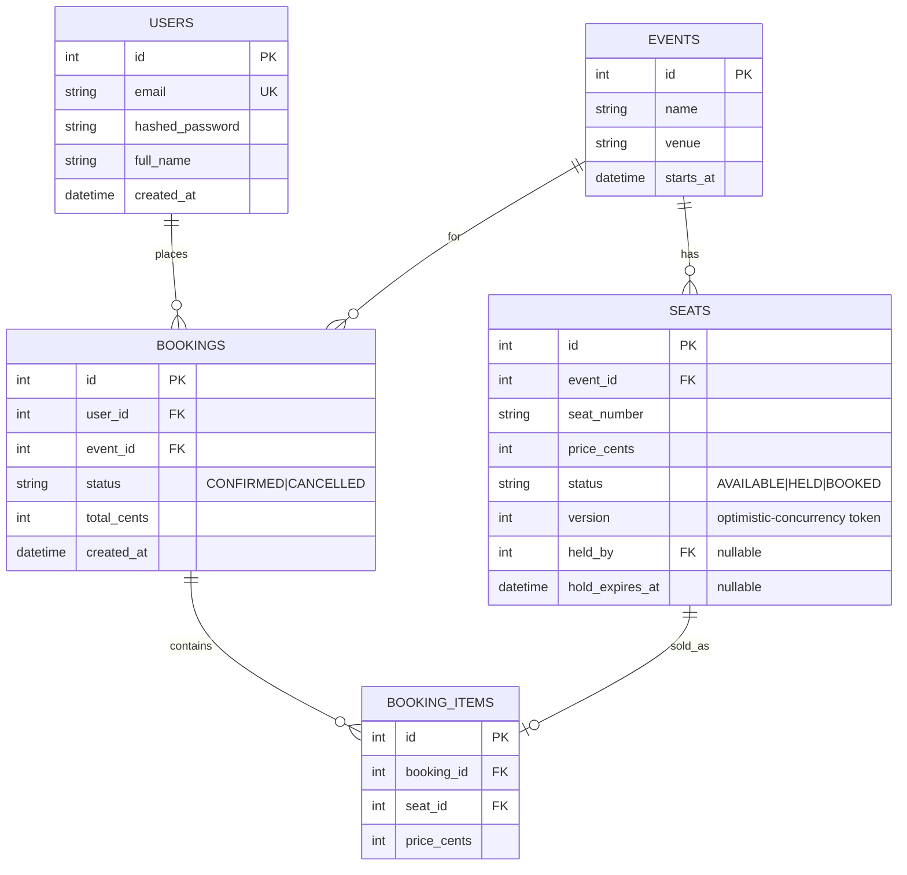
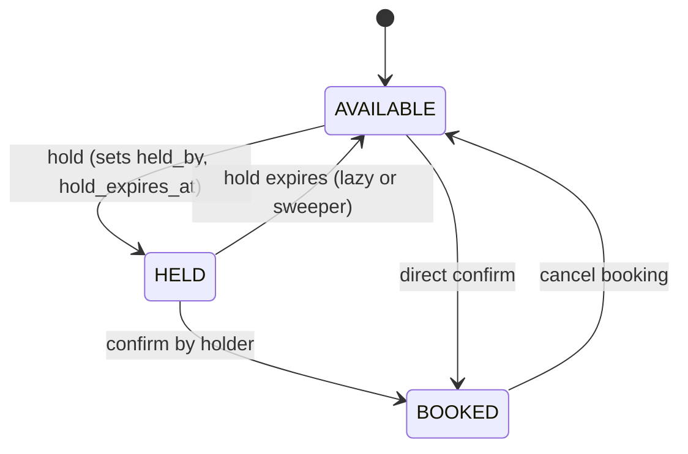

# TicketFlow — Low-Level Design (LLD)

## 1. Data model (ER diagram)



### Key constraints & indexes
- `UNIQUE(event_id, seat_number)` — no duplicate seats per event (DB-enforced).
- Index on `seats.status` and `seats.event_id` — fast seat-map and sweeper reads.
- Index on `bookings.user_id` — fast "my bookings".
- `seats.version` — incremented on every seat mutation; basis for optimistic
  concurrency / stale-read detection.

## 2. Seat state machine



## 3. Concurrency control — the critical section

```python
with multi_lock(sorted_lock_keys):          # Layer 1: Redis distributed lock
    seats = SELECT ... WHERE id IN (...) FOR UPDATE   # Layer 2: DB row lock
    if any seat not bookable_by(user): rollback -> 409
    flip seats -> BOOKED; INSERT booking + items
    COMMIT
# locks released in finally (token-checked Lua delete)
```

### `bookable_by(seat, user, now)` truth table
| status | hold active? | held_by == user? | bookable? |
|---|---|---|---|
| AVAILABLE | – | – | ✅ |
| HELD | no (expired) | – | ✅ (lazy expiry) |
| HELD | yes | yes | ✅ |
| HELD | yes | no | ❌ 409 |
| BOOKED | – | – | ❌ 409 |

### Redis lock invariants
- Acquire: `SET key <random-token> NX PX <ttl>`.
- Release: Lua `if GET key == token then DEL key` — prevents deleting a lock that
  a *later* owner acquired after our TTL lapsed.
- TTL (`lock_ttl_ms`) guarantees no permanent deadlock on worker crash.
- Multi-key acquisition is ordered (sorted seat ids) → no circular wait.

## 4. Pessimistic vs optimistic — why pessimistic here
- **Pessimistic (`FOR UPDATE`)** chosen for the booking write path. On a hot seat,
  contention is the norm; locking makes losers block briefly then fail fast with
  409, instead of all retrying (optimistic would cause a retry storm).
- **Optimistic (`version`)** retained for reads and as the documented alternative:
  `UPDATE seats SET status=..., version=version+1 WHERE id=? AND version=?` and
  check affected-row count. Better when contention is rare.

## 5. API surface
| Method | Path | Auth | Notes |
|---|---|---|---|
| POST | `/auth/register` | – | 201; 409 on duplicate email |
| POST | `/auth/login` | – | OAuth2 password form → JWT |
| GET | `/auth/me` | ✅ | current user |
| GET | `/events` | – | list events |
| POST | `/events` | ✅ | create event + materialise seat map |
| GET | `/events/{id}/seats` | – | live seat map |
| POST | `/bookings/hold` | ✅ + rate-limited | hold seats (TTL) |
| POST | `/bookings` | ✅ + rate-limited | confirm booking |
| GET | `/bookings` | ✅ | my bookings |
| POST | `/bookings/{id}/cancel` | ✅ | cancel + free seats |
| GET | `/health` `/ready` | – | liveness / readiness |

### Status-code contract for the booking endpoints
- `201` booked · `409` seat taken (`{"seats_taken":[...]}`) · `404` seat/event not
  found · `400` too many seats · `429` rate limited · `503` lock contention (retry).

## 6. Module layout
```
app/
  config.py           env-driven settings
  database.py         engine + pooled session factory
  redis_client.py     shared Redis connection
  models.py           ORM models + state constants
  schemas.py          Pydantic request/response (API contract)
  dependencies.py     current-user resolution
  core/security.py    bcrypt + JWT
  core/rate_limit.py  Redis fixed-window limiter
  services/lock.py    Redis distributed lock (multi_lock)
  services/booking_service.py   hold/confirm/cancel/sweep — the domain core
  routers/            auth, events, bookings
  main.py             app wiring + lifespan + sweeper + health
```

## 7. Failure modes & handling
| Failure | Behaviour |
|---|---|
| Redis down | Lock acquisition errors → 503; DB row lock still protects correctness if bypassed. Readiness probe reports degraded. |
| DB transaction conflict | Rolled back; client gets 409. |
| Worker crash mid-lock | Redis TTL frees the lock; DB transaction auto-rolls-back on disconnect. |
| Expired holds | Lazy check + 15 s sweeper return seats to AVAILABLE. |

## 8. Testing strategy
- **`test_booking_concurrency.py`** — N threads, each its own session, race for one
  seat → assert exactly 1 success, N-1 rejected, seat BOOKED, 1 booking row. Also
  asserts independent seats all succeed (locking doesn't over-serialise).
- **`test_api.py`** — auth flow, double-book → 409, seat-map reflects state,
  cancel frees seat.
- CI runs both against real Postgres + Redis service containers.
